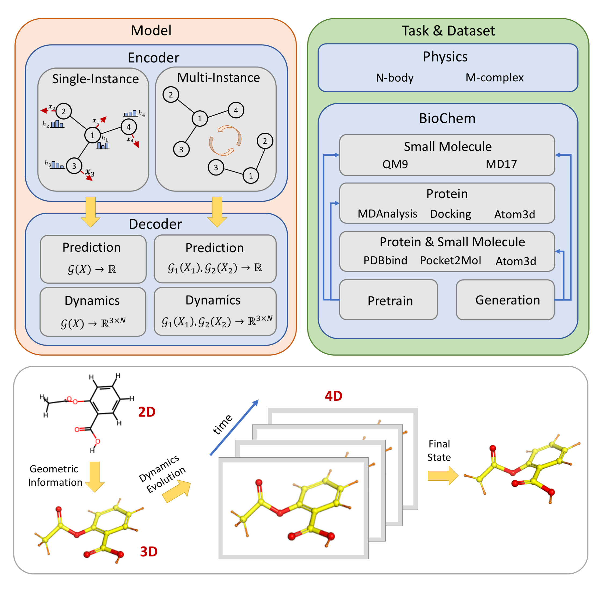
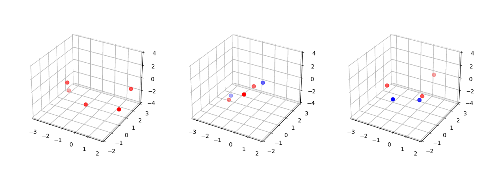

# PySign: Science Informed Graph Networks in Python

Pyign Team,  Tsinghua University

1. Complete resources.
2. Widely-covered models.
3. Uniformed pipelines.
4. Elaborated toolkits.

### Matched Enc-Dec for MD

|                | Scalar   | EquivariantVector | DifferentialVector |
| -------------- | -------- | ----------------- | ------------------ |
| TFN            |          |                   | &#10004;           |
| SE3Transformer |          |                   | &#10004;           |
| RF             |          |                   | &#10004;           |
| EGNN           | &#10004; |                   | &#10004;           |
| SchNet         | &#10004; |                   |                    |
| PaiNN          | &#10004; | &#10004;          |                    |
| ET             | &#10004; | &#10004;          |                    |

### Trajectories on MD17

### Trajectories on NBody

